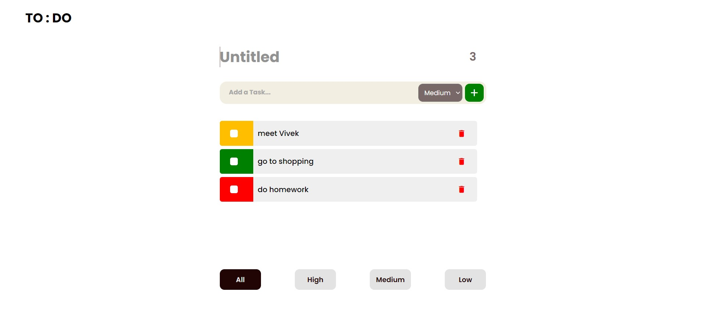
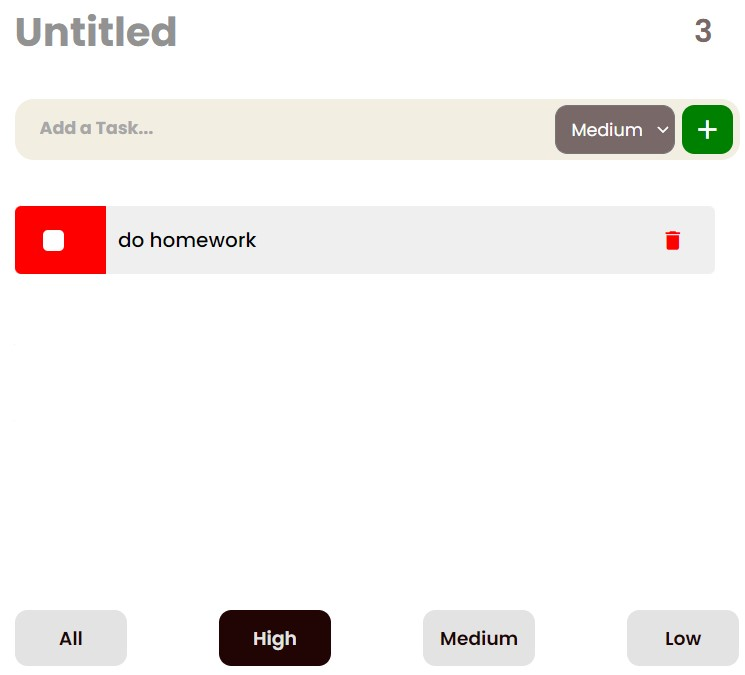
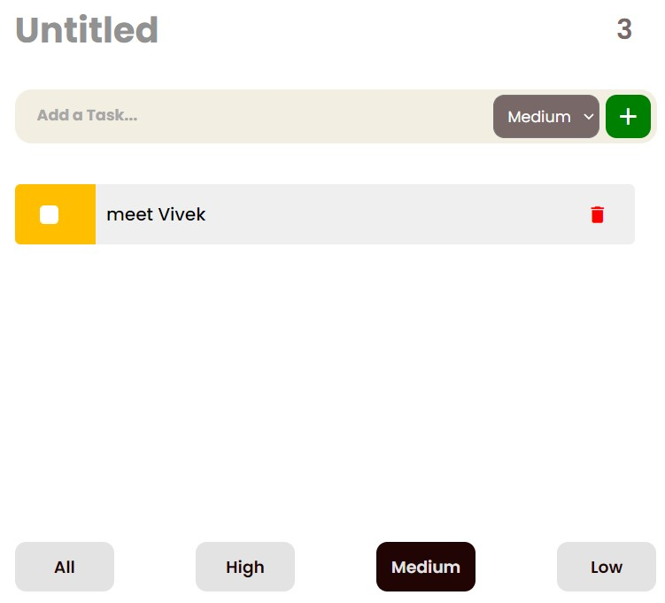
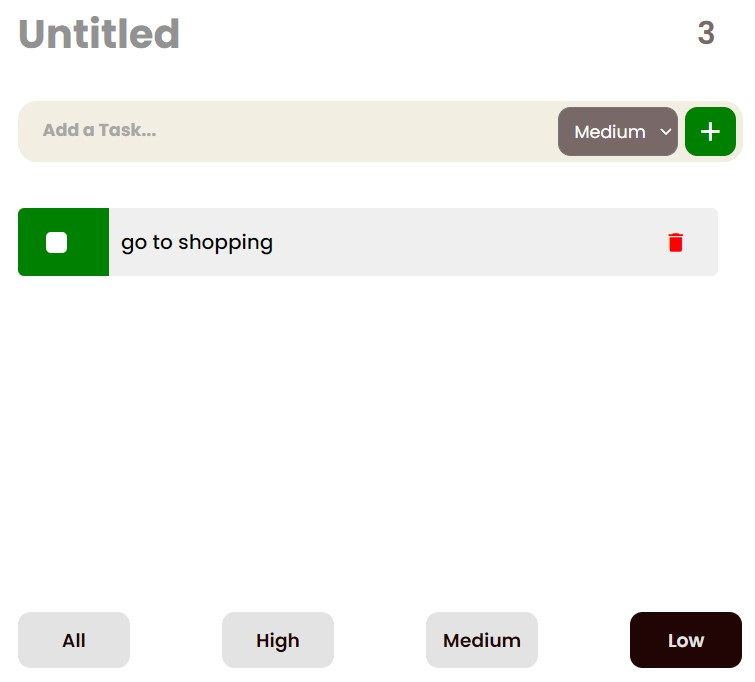

<div id="top"></div>

<br />
<div align="center">
  <h1 align="center">Priority TODO app</h1>

  <p align="center">
    Sort and complete your tasks based on their priority.
  </p>
</div>

## About The Project



I made a to-do list with task priorities and assigned different colours to them based on their importance.
You can also sort your tasks by prioritise.

<div style="display: flex; justify-content: center;">
    
    
    
</div>

- Count on top-right drops as todo is accomplished.
- At the top, you can put a title. You can also delete a todo if it is incorrect.

Here's why:

- to learn how to manipulate the DOM with javascript

## Demo

Here is a quick demo of the app. I hope you enjoy it.

> [The Demo Link](https://naim30.github.io/priority-todo-app/)

## Built With

To build this Landing page I used..

- HTML
- CSS
- JAVASCRIPT

## Getting Started

you do not need any prerequisites for this project just clone the repo and open `index.html` in browser.

Clone the repo

```sh
git clone https://github.com/naim30/priority-todo-app.git
```

## Contact

Naimish Lukhi :
Email - naimlukhi30@gmail.com :
[LinkedIn](https://www.linkedin.com/in/naimish-lukhi-a2b14a1b9)

Project Link: [https://github.com/naim30/priority-todo-app](https://github.com/naim30/priority-todo-app)

<p align="right">(<a href="#top">back to top</a>)</p>
